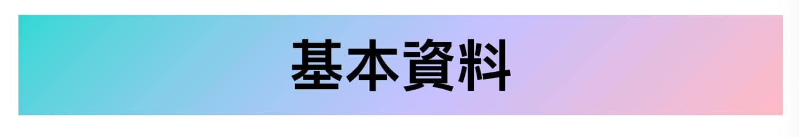

實作專案時，遇到 UI 設計以漸層色作為文字的顏色。


本來以為只要需要將 color 寫入 linear-gradient 即可完成，卻意外發現無法使用此做法將顏色套上。

``` css
/* 此方法無法套上漸層色 */
.text {
  color: linear-gradient(120deg, #e0c3fc 0%, #8ec5fc 100%);
}
```


---

## <font color=#ee6e73> :herb: 解法</font>

搜尋資料後，找到的解法為將背景先設為漸層色後，利用 background-clip，將背景色變成文字的前景色，最後隱藏文字本身的顏色。

---

## <font color=#ee6e73> :herb: 做法</font>

### 模板

```html
<h1>基本資料</h1>
```

### 1. 將背景設為漸層色

``` css
h1 {
  /* 設定背景漸層色 */
  background: linear-gradient(-225deg, #2CD8D5 0%, #C5C1FF 56%, #FFBAC3 100%);
}
```



### 2. 將背景裁切模式設定為文字

`background-clip: text` 指的是將區塊内的文字作為裁切的範圍，文字以外的區域都會被裁切掉

``` css
h1 {
  /* 設定背景漸層色 */
  background: linear-gradient(-225deg, #2CD8D5 0%, #C5C1FF 56%, #FFBAC3 100%);

  /* 背景裁剪為文字的前景色 */
  background-clip: text;
  -webkit-background-clip: text;
}
```


### 3. 將文字顏色設為透明

``` css
h1 {
  /* 設定背景漸層色 */
  background: linear-gradient(-225deg, #2CD8D5 0%, #C5C1FF 56%, #FFBAC3 100%);
  
  /* 背景裁剪為文字的前景色 */
  background-clip: text;
  -webkit-background-clip: text;
  
  /* 文字顏色設定透明 */
  color: transparent;
  text-fill-color: transparent;
  -webkit-text-fill-color: transparent;
}
```


### CodePen 實作

<p 
  class="codepen" 
  data-height="300" 
  data-default-tab="css,result" 
  data-slug-hash="YzgXwJa" 
  data-user="hobbyling" 
  style="height: 300px; box-sizing: border-box; display: flex; align-items: center; justify-content: center; border: 2px solid; margin: 1em 0; padding: 1em;"
>
  <span>
    See the Pen 
    <a href="https://codepen.io/hobbyling/pen/YzgXwJa">
      Untitled
    </a> 
    by hobby (
      <a href="https://codepen.io/hobbyling">@hobbyling</a>
    ) on 
      <a href="https://codepen.io">CodePen</a>.
  </span>
</p>
<script async src="https://cpwebassets.codepen.io/assets/embed/ei.js"></script>
---

## <font color=#ee6e73> :herb: 參考資料</font>

- [CSS 實例-文字漸層色](https://www.eudora.cc/posts/31496#toc0)
- [CSS：文字漸層與鏤空遮罩效果](https://www.tpisoftware.com/tpu/articleDetails/2792)
- [認識 css 屬性 background-clip](https://medium.com/coding-hot-pot/%E8%AA%8D%E8%AD%98-css-%E5%B1%AC%E6%80%A7-background-clip-94592b72a0d0)

---
Photo by <a href="https://unsplash.com/@evieshaffer?utm_content=creditCopyText&utm_medium=referral&utm_source=unsplash">Evie S.</a> on <a href="https://unsplash.com/photos/abstract-art-painting-4nXNP6Pr2Oo?utm_content=creditCopyText&utm_medium=referral&utm_source=unsplash">Unsplash</a>
