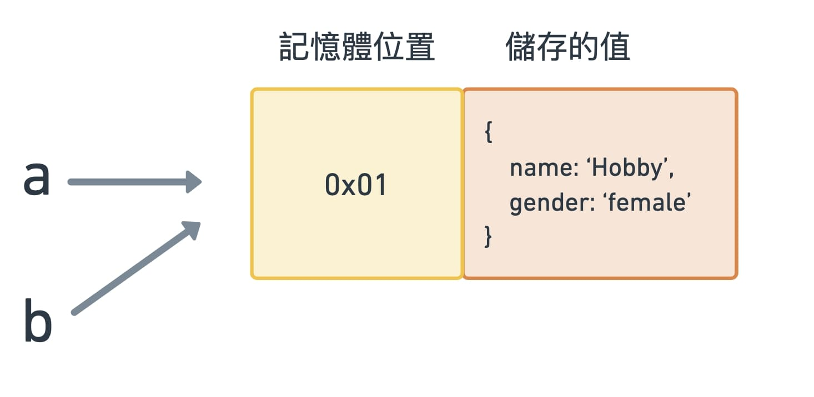

在 JavaScript 中，值的傳遞分為

- Call By Value（傳值），或稱 Pass by value
- Call By Reference（傳參考、傳址），或稱 Pass by reference

要使用哪種方式傳遞，是根據值的型別來決定的

## <font color=#ee6e73> :herb: 值的型別</font>

可分成

### Primitive values（基本型別）

> **這一類的型別傳遞方式為 Call by Value**

被定義為基本型別，包含

- Boolean：布林
- Null：空值
- Undefinded：未定義
- Number：數字
- BigInt：數字，支援比 Number 更大範圍的整數值
- String：字串
- Symbol：符號，ES6 新定義

可參考 [JavaScript 的資料型別與資料結構](https://developer.mozilla.org/zh-TW/docs/Web/JavaScript/Data_structures#%E8%B3%87%E6%96%99%E5%9E%8B%E5%88%A5)

### Object（物件型別）

> **傳遞方式為 Call by Reference**

除了被定義為基本型別外的其他型別，都屬於物件型別，包含

- Object：物件
- Array：陣列
- Function: 函式

---

## <font color=#ee6e73> :herb: Call By Value</font>

**複製的是「值」**

- 當 c = a 時，是將 a 的值複製了一份，再放入新的，且獨立的記憶體空間中給 c

```javascript
const a = 10;
const b = 20;
const c = a;
```


---

- 當 a 產生變化時，是不會連動影響到 c 的

```javascript
const a = 10;
const b = 20;
const c = a;

a++;
```


---

- 這邊的比較，是比較 a 和 b 的值，因此會回傳 true

```javascript
const a = 10
const b = 10

console.log(a === b)
-----
// true

```

---

## <font color=#ee6e73> :herb: Call By Reference</font>

**複製會讓變數指向同樣的「記憶體位置」**

- 當 b = a 時，是將 b 指向原本 a 記憶體位置

```javascript
const a = {
  name: "Hobby",
  gender: "female",
};

const b = a;
```



---

- 當 a 改變時，b 也會連帶影響，因為是指向同樣的位置

```javascript
const a = {
  name: "Hobby",
  gender: "female",
};

const b = a;

a.name = "Aaron"

console.log(b)
-----
/*
{
  name: "Aaron",
  gender: "female"
}
*/
```

---

- 當比較 a 和 b 時，比較的是「記憶體位置」，因此回傳 true

```javascript
const a = {
  name: "Hobby",
  gender: "female",
};

const b = a;
console.log(a === b);
----
// true

```

---

- 當 a 和 b 寫入同樣的內容，但因為記憶體位置不同，若互相比較，回傳的會是 false

```javascript
const a = {
  name: "Hobby"
};

const b = {
  name: "Hobby"
};

console.log(a === b);
----
// false
```


---

## <font color=#ee6e73> :herb: 參考資料</font>

- [深入探討 JavaScript 中的參數傳遞：call by value 還是 reference？](https://blog.techbridge.cc/2018/06/23/javascript-call-by-value-or-reference/)
- [[筆記] 談談 JavaScript 中 by reference 和 by value 的重要觀念](https://pjchender.blogspot.com/2016/03/javascriptby-referenceby-value.html)
- [[ 技術筆記 ] JavaScript ｜傳值（by Value） / 傳址（by Reference）差異](https://medium.com/@sunnyhuang.sc/%E6%8A%80%E8%A1%93%E7%AD%86%E8%A8%98-javascript-%E5%82%B3%E5%80%BC-by-value-%E5%82%B3%E5%9D%80-by-reference-%E5%B7%AE%E7%95%B0-db3124ddd691)
- [[JavaScript] Javascript 中的傳值 by value 與傳址 by reference](https://medium.com/itsems-frontend/javascript-pass-by-value-reference-sharing-5d6095ae030b)
- [JavaScript 基本功修練：Day6 - 傳址、傳值](https://ithelp.ithome.com.tw/articles/10241346)
- [JavaScript 的資料型別與資料結構](https://developer.mozilla.org/zh-TW/docs/Web/JavaScript/Data_structures#objects)

---

Photo by <a href="https://unsplash.com/@evieshaffer?utm_source=unsplash&utm_medium=referral&utm_content=creditCopyText">Evie S.</a> on <a href="https://unsplash.com/s/photos/plant?utm_source=unsplash&utm_medium=referral&utm_content=creditCopyText">Unsplash</a>
