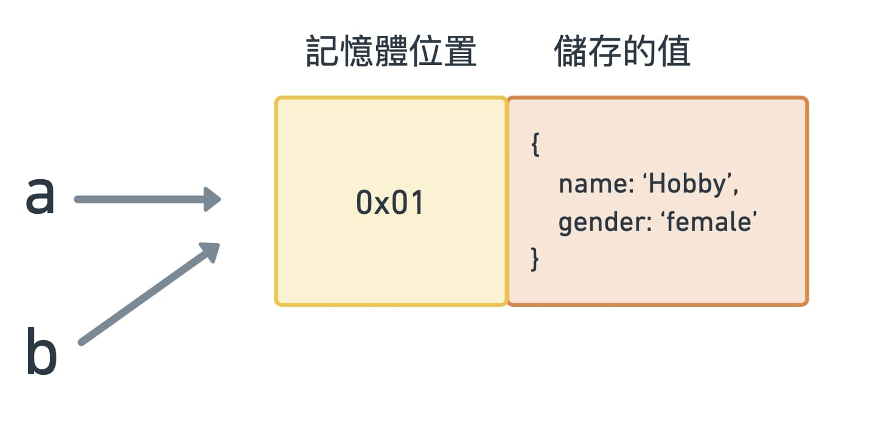
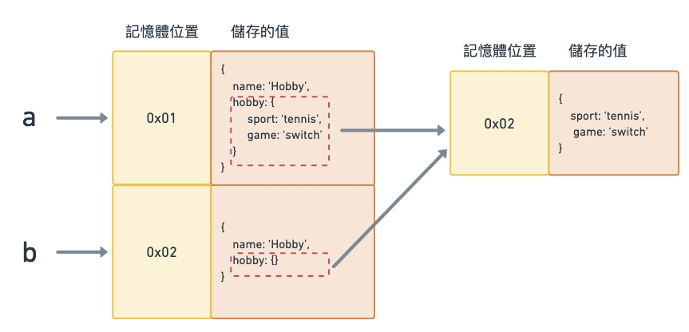

在 [Call By Value & Call By Reference](https://hobbyling.github.io/2022/04/21/javascript-callbyvalueorreference/) 中曾經提到值的型別以及傳遞方式。
而這篇文章會針對 Call By Reference 中的資料複製方法，做更詳細的說明。

---

## <font color=#ee6e73> :herb: Shallow Copy（淺拷貝）</font>

Object（物件型別）的資料型別會把東西連到某個記憶體空間，而非本身的值。因此在複製時，是讓變數指向同樣的「記憶體位置」，而非複製出一個全新的記憶體位置及值。

```javascript
const a = {
  name: "Hobby",
  gender: "female",
};

const b = a;
```



### 方法一

當改變其中一個變數內容時，會連帶影響到另外一個，因為是指向同樣的位置

{% iframe https://codepen.io/hobbyling/embed/QWQLwaQ?default-tab=js 100% 500px %}

### 方法二：Object.assign()

- Object.assign() 的方法在單層物件時，的確可以達到深複製效果

{% iframe https://codepen.io/hobbyling/embed/WNMebXX?default-tab=js 100% 500px %}

- 若物件裡還有物件型別的資料，則內層資料同樣會指向同一位置，因此仍會相互影響



{% iframe https://codepen.io/hobbyling/embed/rNJBazQ?default-tab=js 100% 500px %}

### 方法三：展開語法(Spread syntax)

- 使用 ES6 的語法糖-展開語法(Spread syntax)，也會遇到與 Object.assign() 一樣的問題

{% iframe https://codepen.io/hobbyling/embed/MWQgYoX?default-tab=js 100% 500px %}

- 若物件裡還有物件型別的資料

{% iframe https://codepen.io/hobbyling/embed/yLvByMj?default-tab=js 100% 500px %}

---

## <font color=#ee6e73> :herb: Deep Copy（深拷貝）</font>

### 方法一：JSON.stringify()、JSON.parse()

- 利用 JSON.stringify() 先將資料轉成基本型別，即可複製值，接著再利用 JSON.parse() 將文字轉成物件

{% iframe https://codepen.io/hobbyling/embed/oNEvgLK?default-tab=js 100% 500px %}

### 方法二：Lodash 套件的 \_.cloneDeep 方法

- 利用 [Lodash](https://www.lodashjs.com/docs/lodash.cloneDeep) 套件的 \_.cloneDeep 方法，即可深拷貝資料

{% iframe https://codepen.io/hobbyling/embed/zYROOaB?default-tab=js 100% 500px %}

---

## <font color=#ee6e73> :herb: 參考資料</font>

- [MDN](https://developer.mozilla.org/zh-TW/docs/Web/JavaScript/Reference/Global_Objects/Object/assign)
- [關於 JS 中的淺拷貝(shallow copy)以及深拷貝(deep copy)](https://medium.com/andy-blog/%E9%97%9C%E6%96%BCjs%E4%B8%AD%E7%9A%84%E6%B7%BA%E6%8B%B7%E8%B2%9D-shallow-copy-%E4%BB%A5%E5%8F%8A%E6%B7%B1%E6%8B%B7%E8%B2%9D-deep-copy-5f5bbe96c122)

---

Photo by [Katrin Hauf](https://unsplash.com/@trine?utm_source=unsplash&utm_medium=referral&utm_content=creditCopyText) on [Unsplash](https://unsplash.com/s/photos/flower?utm_source=unsplash&utm_medium=referral&utm_content=creditCopyText)
