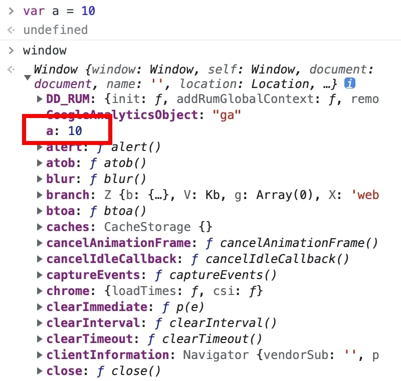

在 JavaScript 中，宣告變數的方式有三種，分別為 var, let 以及 const。
三種方式皆可宣告變數，但使用的方式和情境有些許落差，以下針對這三個方式進行更細部的說明。

## <font color=#ee6e73> :herb: var</font>

> 傳統變數宣告的方式

#### 全域性

所宣告的變數在函式作用域 (function scope) 內有效

```javascript
function test(){
  var a = 10
}

if (true){
  var b = 20
}

console.log(a) // a is not defined 存取不到
console.log(b) // 存取得到
```

- 如果在函式外宣告的話，其作用範圍則為全域性
- var 所宣告的變數都會存到 window 中，若有多位開發者同時開發檔案，會造成變數相互污染

```javascript
// 這段宣告擇一執行
var name = "Hobby";
let name = "Aaron";

console.log(window.name);
// var 會出現 "Hobby"
// let 會出現 undefined
```



---
## <font color=#ee6e73> :herb: let</font>

> ES6 出現的新語法

#### 區域性

所宣告的變數僅在程式區塊內有效 (block-scoped)

```javascript
var arr = [1 ,2, 3];
if (true){
  let arr = [];
}

console.log(arr);

//console 回應結果是 var 所宣告的內容，而不是 let
[1, 2, 3]
```

#### 可變動

當變數宣告後，值仍可被改變

``` javascript
let a = 10
console.log(a) // 10

a = 20
console.log(a) // 20

```

---

## <font color=#ee6e73> :herb: const</font>

> ES6 出現的新語法

#### 區域性

所宣告的常數僅在程式區塊內有效 (block-scoped)

```javascript
if (true){
  const age = 27;
}

console.log(age);  //顯示`ReferenceError: age is not defined`
```

#### 不可變動

唯讀變數，當變數宣告後，值不能再被改變

```javascript
const age = 27;
console.log(age);  // 顯示'27'

age = 30;
console.log(age);  //顯示'TypeError: Assignment to constant variable'
```

#### 可被變動的例外情況

當使用 const 在宣告陣列 [ ] 或物件 { } 時，可變更陣列裡的值，但無法重新指定該陣列 / 物件。

原因是因為陣列、物件是屬於 Call By Reference，仍是指向同樣的記憶體位置。可參考 [Call By Value & Call By Reference](https://hobbyling.github.io/2022/04/21/javascript-callbyvalueorreference/)

- array 範例

```javascript
const utensils = ['Fork', 'Knife', 'Chopsticks', 'Spork'];

utensils.pop();
console.log(utensils);  
// show  ['Fork', 'Knife', 'Chopsticks']

// 若想直接改變變數，會發生錯誤
utensils = ['Hobby'];
// Uncaught TypeError: Assignment to constant variable.
```

- object 範例

```javascript
const user = { 'name': 'Hobby' };
user['sex'] = female;

console.log(user);  
//show { name: ‘Hobby’, sex: ‘female’}

// 若想直接改變變數的型別，會發生錯誤
user = { 'gender': 'female'}
// Uncaught TypeError: Assignment to constant variable.

```

若想要鎖定值不被更動，可以用 Object.freeze( ) 語法

```javascript
const obj = { url: 'http://www.yahoo.com.tw' };

Object.freeze(obj);
```

---
## <font color=#ee6e73> :herb: 總整理</font>

|  類型   | var  | let  | const  |
| :----: | :----: |:----: | :----: |
| 範圍  | 全域/區域 | 區域 | 區域 |
| 可變動  | o | o | x |

---

## <font color=#ee6e73> :herb: 參考資料</font>

- [[筆記] JavaScript ES6 中使用 const 宣告常數](https://pjchender.blogspot.com/2017/01/const.html)
- [鐵人賽：ES6 開始的新生活 let, const](https://www.casper.tw/javascript/2017/12/20/javascript-es6-let-const/)
- [JavaScript: var, let, const 差異](https://totoroliu.medium.com/javascript-var-let-const-%E5%B7%AE%E7%95%B0-e3d930521230)

---

Photo by <a href="https://unsplash.com/@scottwebb?utm_source=unsplash&utm_medium=referral&utm_content=creditCopyText">Scott Webb</a> on <a href="https://unsplash.com/?utm_source=unsplash&utm_medium=referral&utm_content=creditCopyText">Unsplash</a>
  