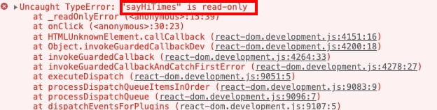

在 React 定義一個變數，若直接更改變數的值，是無法更新畫面的。

如以下範例，點下「Say Hi」按鈕後，在 console 可以看到 sayHiTimes 的值是有增加的，但畫面上的值卻沒有被更新

{% iframe https://codepen.io/hobbyling/embed/zYWMyGK?default-tab=js 100% 500px %}

---

## <font color=#ee6e73> :herb: useState</font>

useState 是 React Hook 的其中一種 Function，是可以讓我們增加 React state 到 function component 的 Hook

### 結構

useState 的結構是函式，會 return 陣列，因此使用陣列解構賦值來取值。

- 第一個值：目前 state 的值
- 第二個值：可以更新 state 的 function

> 這兩個值是可以自定義名稱的，通常會用 set+ [第一個值]， 例如 [num, setNum]。

```javascript
const useState = function () { 
	...
	return[val, function(newVal){...}]
}
```

### 宣告 State 變數

要先引入 useState 才能呼叫，接著在 function 裡宣告變數。

> 放在 useState 裡的值，便是 num 的起始值。

```javascript
const { useState } = React;

function App() {
  const [num, setNum] = useState(1)
}

```

### 使用多個 State 變數

可以宣告多組變數，因為都是一對一對的，也方便管理

```javascript
function App() {
  const [name, setName] = useState('Hobby')
  const [age, setAge] = useState(32)
  const [todo, setTodo] = useState([{
    text: 'Learn React',
    finish: false
  }])
}
```


### 範例

將開頭的範例改用 useState 方式改寫，便可更新畫面上的值

{% iframe https://codepen.io/hobbyling/embed/GRdKrOG?default-tab=js 100% 500px %}


### 若嘗試直接修改變數，不透過函式

若定義了 useState，但不透過定義好的函式去修改變數，結果
畫面不會更新，且會報錯 "sayHiTimes" is read-only

> useState 的變數只能透過定義的好的函式修改內容



---

## <font color=#ee6e73> :herb: 參考資料</font>

- [React 官方文件- 使用 State Hook](https://zh-hant.reactjs.org/docs/hooks-state.html)

---

Photo by <a href="https://unsplash.com/@pawel_czerwinski?utm_source=unsplash&utm_medium=referral&utm_content=creditCopyText">Pawel Czerwinski</a> on <a href="https://unsplash.com/?utm_source=unsplash&utm_medium=referral&utm_content=creditCopyText">Unsplash</a>
  