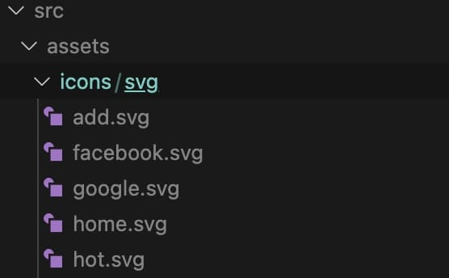

在專案中使用 svg 時，最常見的方式是使用 img 標籤引入。
而此作法無法讓 svg 改變顏色，僅能再使用另一個不同顏色的 svg 去做處理。專案內也需要存放一大堆同樣樣式的 svg ，但顏色不同的檔案，並不易管理。

```html


```

## <font color=#ee6e73> :herb: 使用 svg-sprite-loader</font>

為了能夠更有效率的管理並使用 svg，查詢到 svg-sprite-loader 套件，可以解決當前遇到的困難，馬上嘗試看看！

### Step1：安裝套件
`npm install svg-sprite-loader -save`
`npm install fs -save`

### Step2：建立 svg 檔案放置路徑

在 src 資料夾下建立資料夾階層： assets / icons / svg ，所有 svg 檔案皆放在 svg 資料夾內



### Step3：新增 SvgIcon.vue 檔案

在 components 裡新增 SvgIcon.vue 檔案，此檔案被用來當作 svg 引入的入口檔案

```vue3
<template>
  <svg :class="svgClass" v-bind="$attrs" :style="{ color: color }">
    <use :xlink:href="iconName" />
  </svg>
</template>

<script setup>
import { defineProps, computed } from "vue";

const props = defineProps({
  name: {
    type: String,
    required: true,
  },
  color: {
    type: String,
    default: "#666666", // 預設 svg 顏色
  },
});

const iconName = computed(() => `#icon-${props.name}`);
const svgClass = computed(() => {
  // console.log(props.name, "props.name");
  if (props.name) {
    return `svg-icon icon-${props.name}`;
  }
  return "svg-icon";
});
</script>

<style lang='scss'>
.svg-icon {
  width: 1.2em; // 預設 svg 大小，可自行調整
  height: 1.2em; // 預設 svg 大小，可自行調整
  fill: currentColor;
  vertical-align: middle;
}
</style>

```

### Step4：在 main.js 裡全局引入 icon 元件

在全局引入，可減去在每個元件內單獨引入的麻煩

```javascript
import App from './App.vue'
import svgIcon from './components/SvgIcon.vue'

const app = createApp(App)

// 'icon'：可自行命名全局引用的名稱
app.component('icon', svgIcon)
app.mount('#app')
```

### Step5：新增 svgBuilder.js 檔案

在 plugins 裡新增 svgBuilder.js 檔案

```javascript
import { readFileSync, readdirSync } from 'fs'

let idPerfix = ''
const svgTitle = /<svg([^>+].*?)>/
const clearHeightWidth = /(width|height)="([^>+].*?)"/g

const hasViewBox = /(viewBox="[^>+].*?")/g

const clearReturn = /(\r)|(\n)/g

function findSvgFile(dir) {
  const svgRes = []
  const dirents = readdirSync(dir, {
    withFileTypes: true
  })
  for (const dirent of dirents) {
    if (dirent.isDirectory()) {
      svgRes.push(...findSvgFile(dir + dirent.name + '/'))
    } else {
      const svg = readFileSync(dir + dirent.name)
        .toString()
        .replace(clearReturn, '')
        .replace(svgTitle, ($1, $2) => {
          // console.log(++i)
          // console.log(dirent.name)
          let width = 0
          let height = 0
          let content = $2.replace(
            clearHeightWidth,
            (s1, s2, s3) => {
              if (s2 === 'width') {
                width = s3
              } else if (s2 === 'height') {
                height = s3
              }
              return ''
            }
          )
          if (!hasViewBox.test($2)) {
            content += `viewBox="0 0 ${width} ${height}"`
          }
          return `<symbol id="${idPerfix}-${dirent.name.replace(
            '.svg',
            ''
          )}" ${content}>`
        })
        .replace('</svg>', '</symbol>')
      svgRes.push(svg)
    }
  }
  return svgRes
}

export const svgBuilder = (path, perfix = 'icon') => {
  if (path === '') return
  idPerfix = perfix
  const res = findSvgFile(path)
  // console.log(res.length)
  // const res = []
  return {
    name: 'svg-transform',
    transformIndexHtml(html) {
      return html.replace(
        '<body>',
        `
          <body>
            <svg xmlns="http://www.w3.org/2000/svg" xmlns:xlink="http://www.w3.org/1999/xlink" style="position: absolute; width: 0; height: 0">
              ${res.join('')}
            </svg>
        `
      )
    }
  }
}
```

### Step6：修改 vite.config.js 設定

```javascript
import { svgBuilder } from './src/plugins/svgBuilder';

export default defineConfig({
  plugins: [svgBuilder('./src/assets/icons/svg/')]
})
```

### Step7：在元件內使用

```html
<icon name="search" color="pink" />
```

---

## <font color=#ee6e73> :herb: 參考資料</font>
- [在vue3+vite项目中使用svg](https://segmentfault.com/a/1190000039255368)
- [在 Vue 聰明使用 SVG-Icon](https://ithelp.ithome.com.tw/articles/10230334)
- [svg-sprite-loader 官方文件](https://github.com/JetBrains/svg-sprite-loader)

---

Cover: Photo by Evie S. on [Unsplash](https://unsplash.com/photos/KEBfFP_0w_Q)