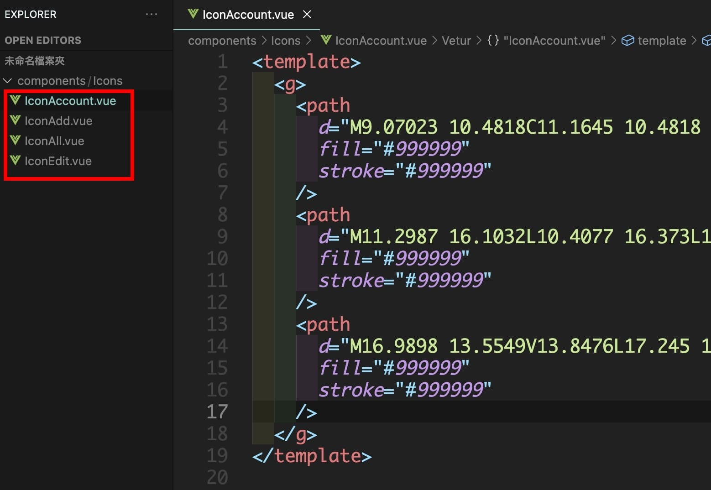
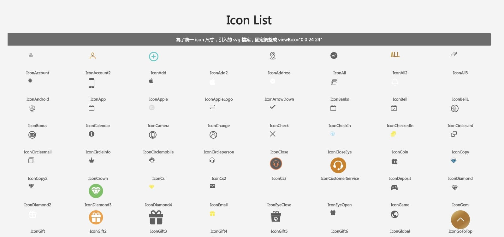

當初建制專案的 SVG 系統，是使用 [Vue 官方方法](https://v2.cn.vuejs.org/v2/cookbook/editable-svg-icons.html)。
隨著專案越來越大，用到的 svg 元件也隨之增加。每當要使用到 Icon 時，便遇到了因為無法預覽 svg 元件樣式的困擾。
希望能夠在頁面中列出所有的 Icon，方便之後實作時能夠選用。
而因為 svg 元件數量有數十個，一個個單獨引入非常麻煩，因此希望能透過程式，在元件中一次全部引入。


## <font color=#ee6e73> :herb: Step1: 找出所有目標資料夾內的檔案</font>

在 src/utils 資料夾下新增 icon.js 檔案，寫入以下內容

```javascript
// 找出 components/icons 資料夾下所有 .vue 結尾的檔案
const allComponents = require.context('../components/icons', false, /\.vue$/)

// 制作元件組，提供 components 中註冊使用
const ResComponents = {}

const re = /\.\/(.*)\.vue/

allComponents.keys().forEach(item => {
  // item ： 檔案名稱 ./IconOpenEye.vue
  const comp = allComponents(item)
  ResComponents[item.match(re)[1]] = comp.default
})

export default ResComponents

```

## <font color=#ee6e73> :herb: Step2: 在元件中引入檔案並呈現</font>

在要呈現 Icon 清單的元件裡，引入剛剛寫好的 js 檔案

> 原本照著參考文件的做法，將 ResComponents 直接寫在 components: {} 裡，但是一直無法正常渲染，改用 computed 回傳結果才成功。

```javascript
<script>
import IconBase from '../../components/IconBase.vue'
import ResComponents from '../../utils/icon'

export default {
  name: 'Icon',
  components: {
    IconBase
  },
  computed: {
    res() {
      return ResComponents
    }
  }
}
</script>
```

```html
<template>
  <div class="icon-list">
    <h1>Icon List </h1>
    <div class="description">
      為了統一 icon 尺寸，引入的 svg 檔案，固定調整成 viewBox="0 0 24 24"
    </div>
    <div>
      <div :span="3" v-for="(item, key) in res" :key="key">
        <div class="icon">
          <IconBase height="60" width="60">
            <component :is="res[key]" />
          </IconBase>
          <span>{{ key }}</span>
        </div>
      </div>
    </div>
  </div>
</template>
```

## <font color=#ee6e73> :herb: 實際結果</font>




---

## <font color=#ee6e73> :herb: 參考資料</font>

- [怎么在vue中批量引入组件](https://www.yisu.com/zixun/453672.html)
- [webpack 官方文件](https://webpack.docschina.org/guides/dependency-management/#requirecontext)

---

Photo by <a href="https://unsplash.com/@pawel_czerwinski?utm_source=unsplash&utm_medium=referral&utm_content=creditCopyText">Pawel Czerwinski</a> on <a href="https://unsplash.com/?utm_source=unsplash&utm_medium=referral&utm_content=creditCopyText">Unsplash</a>
  